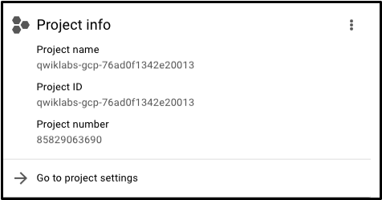
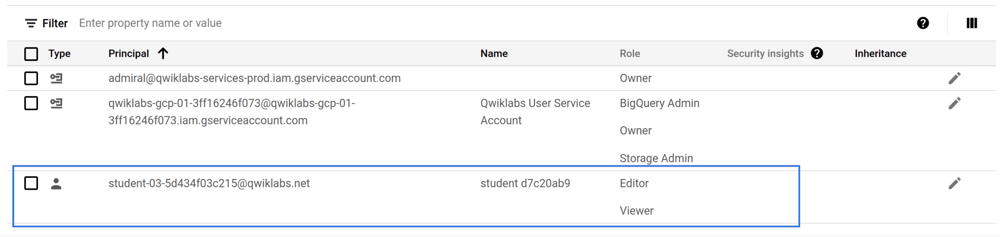
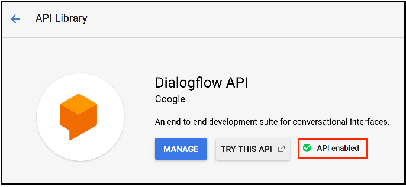

# A Tour of Google Cloud Hands-on Labs

GSP282

Project ID: qwiklabs-gcp-03-98f16efacb52

## Overview

Google Cloud is a suite of cloud services hosted on Google's infrastructure. From computing and storage to data analytics, machine learning, and networking. In this introductory-level lab, you take your first steps with Google Cloud by getting hands-on practice with **Cloud Console** - an in-browser UI that lets you access and manage GCP.

### What you'll learn

* The lab platform, and how to identify key features of a lab environment
* How to access the Cloud console with specific credentials
* Google Cloud projects, and identify common misconceptions about them
* How to use the Google Cloud Navigation menu to identify types of Google Cloud services
* Basic roles, and use the Cloud IAM service to inspect actions available to specific users
* The API library, and examine its chief features

### Projects in the Cloud console

### Roles and permissions

In addition to cloud computing services, Google Cloud also contains a collection of permissions and roles that define who has access to what resources. You can use the Cloud Identity and Access Management (Cloud IAM) service to inspect and modify these roles and permissions.

#### View your roles and permissions

On the Navigation menu (Navigation menu), click IAM & Admin > IAM. This opens a page that contains a list of users and specifies permissions and roles granted to specific accounts.

Find the student "@qwiklabs" username you signed in with:

| Role Name | Permissions |
|:-:|:-:|
| roles/viewer |	Permissions for read-only actions that do not affect state, such as viewing (but not modifying) existing resources or data. |
| roles/editor |	All viewer permissions, plus permissions for actions that modify state, such as changing existing resources. |
| roles/owner |	All editor permissions and permissions for the following actions: manage roles and permissions for a project and all resources within the project; set up billing for a project. |

#### APIs and services

Google Cloud APIs are a key part of Google Cloud. Like services, the 200+ APIs, in areas that range from business administration to machine learning, all easily integrate with Google Cloud projects and applications.

APIs are application programming interfaces that you can call directly or via the client libraries. Cloud APIs use resource-oriented design principles as described in the [API Design Guide](https://cloud.google.com/apis/design/).

Enable the Diaglogflow API:

That's really it. As for the next module, it focuses on:

* routing
* GKE clusters
* firewalls
* VPC service controls

---

↩️ [BACK](./README.md)
