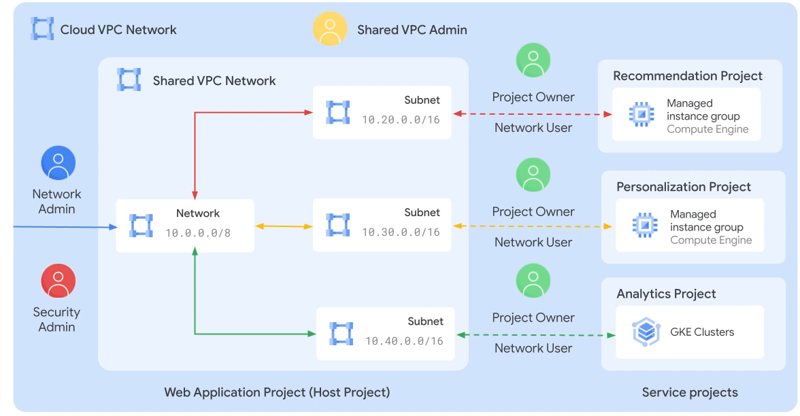
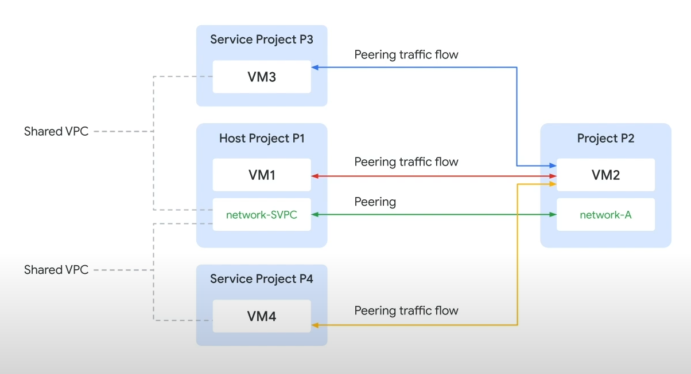
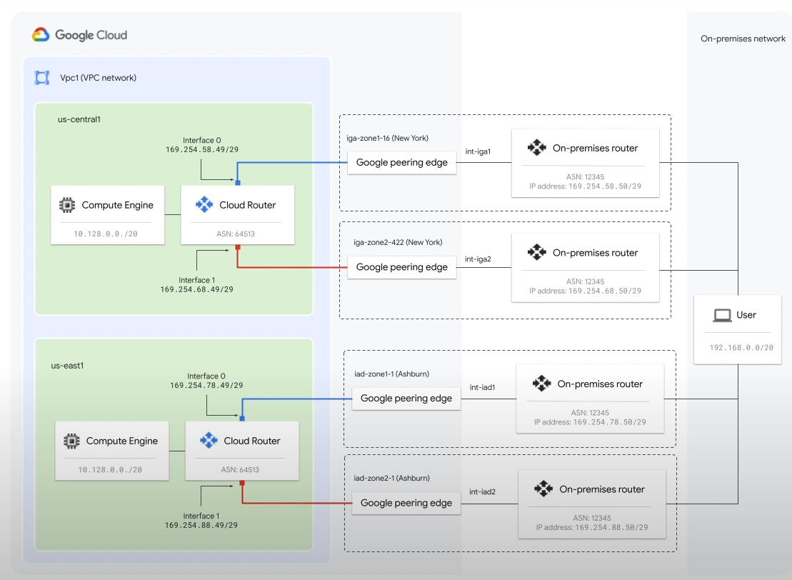
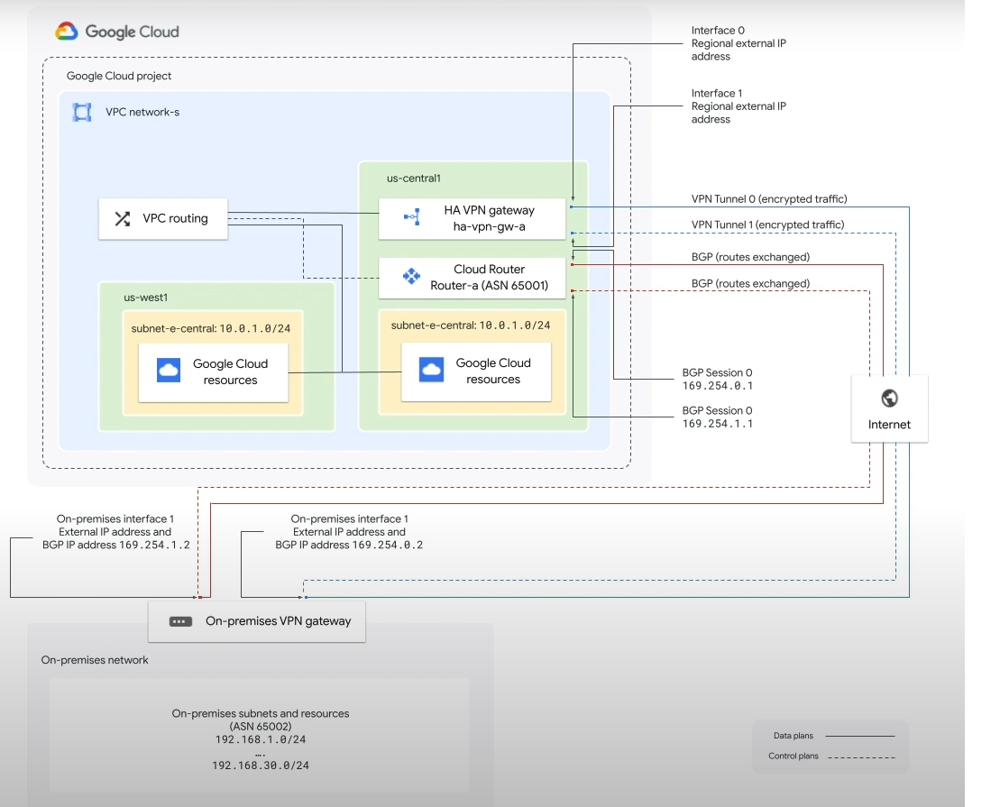
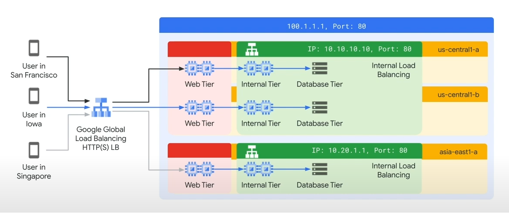
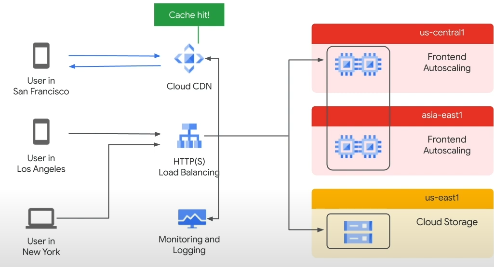
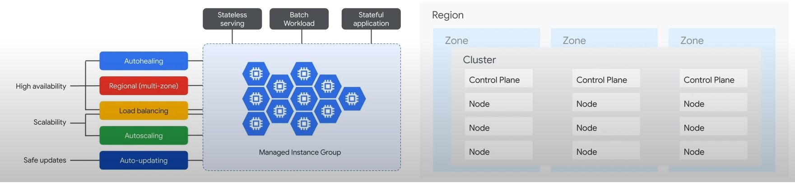

# Google Cloud QuikLabs

* [A Tour of Google Cloud Hands-on Labs](./ATOGCHOL.md)

## Preparing for your Professional Cloud Network Engineering Journey

### Cymbal Bank's VPC network architecture

* deploy 3 shared VPC networks using subnet from project 
* service projects provided by teams will deploy resources into and use the shared VPC
* assign access to network resources using IAM
    + Shared VPC admin
    + computer network user
    + network admin
    + security admin

---

Example of standalone VPC

### Connecting Cymbal Bank's network to Google Cloud

Dedicated interconnect and Partner Interconnect will connect data centers to Google Cloud regions

* mix of regular and high availability configurations
* mix of layer-2 and layer-3 partner interconnect

### Cymbal Bank's Cloud VPN connecting branches and office to closest regions

Cloud VPN connecting branches and offices to closet region

* mix of HA and Classic VPN
* mix of static routing and dynamic routing with BGP and Cloud Routers

### Ensuring network availablity and performance

* Layer 7, utilizing global external and regional internal HTTP(S) LBs
* Provides capacity and low latency serving of static and dynamic resources

### Cloud CDN

Cloud CDN caches static resources to increase capacity and reduces latency for static resources

### Cloud Armor

Provides web-application firewall attack and DDoS protection

### Network monitoring and debugging with operations suite

* VPC flow logs
* firewall logs
* cloud monitoring metrics for network activity
* cloud trace for latency across microservices
* logs may be exported to Pubsub, Cloud storage, or BigQuery

## Cymbal Bank networking in Google Cloud

* deploy legacy monolits as managed instance groups of VMs
* deploy new microservices to GKE
* convert some monoliths to microservices and deploy to GKE

---

↩️ [BACK](../../../README.md)
