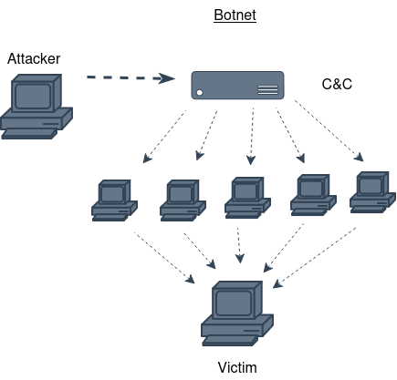
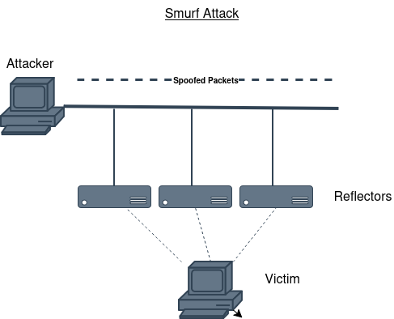
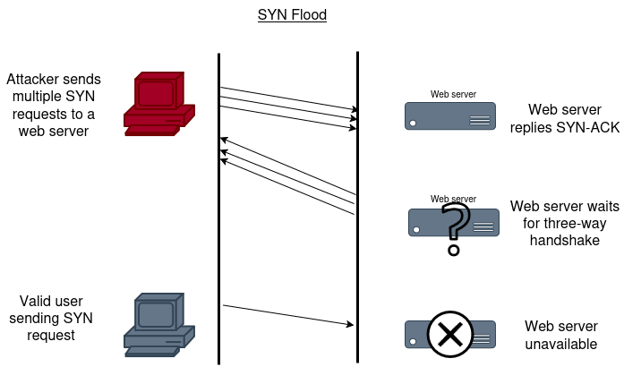
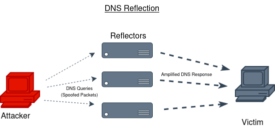
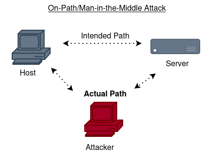
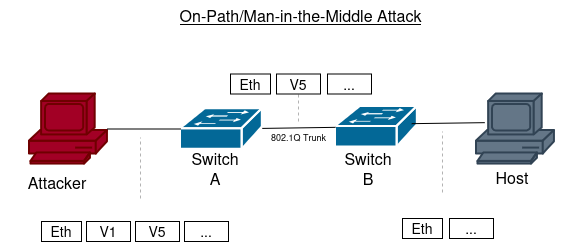
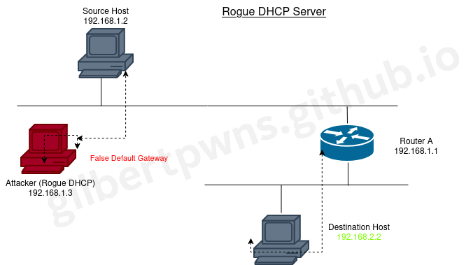

# CCST Cisco® Certified - Support Technician

This study guide assumes you have experience in IT.

## Study Guide - Cybersecurity Exam

### Chapter 1 - Security Concepts

Essential Security Principles

**1.1. Define essential security princples**

Vulnerabilities, threats, exploits, and risks; attack vectors; hardening; defense-in-depth; confidentiality, integrity, availability (CIA triangle); types of attackers; reasons for attacks; code of ethics

**1.2. Explain common threats and vulnerabilities**

Malware, ransomeware, denial of service, botnets, social engineering attacks (tailgating, spear phishing, phishing, vishing, smishing etc.), physical attacks, man in the middle, IoT vulnerabilities, insider threats, APTs

#### **Technology Based Attacks**

* **Denial of Service (DoS)/Distributed Denial of Service (DDoS)**
    - Mostly a thing of the past, not truly respected among security professionals as simplicity and it's ease to deploy
* **The Ping of Death**
    - Ping is primarily used to see whether a computer is responding to IP requests. 
    - A typical ping to a remote host consists of sending four normal-sized ICMP packets to a remote host to see whether it's available.
    - For a ping-of-death attack, a humongous ICMP packet is sent to the remote host victim, totally flooding the victim's buffer and causing the system to reboot, or helplesssly hang there, drowning. It's good to know what patches are available for most operating systems to prevent a ping-of-death attack from working.
* **Distributed Denial of Service (DDoS)**
    - Denial of Service attacks can be made more effective if they can be amplified by recruiting helpers in the attack process. Following this section is a number of effective methods explained.

### Botnet/Command and Control

A botnet is a group of programs connected to the Internet for the purpose of performing a task in a coordinated manner. Some botnets, such as those created to maintain control of IRC channels, are legal, where others are illegaly created to leverage a DDoS.

*Figure 1.1*

#### Steps in building a botnet

1. botnet operator sends out viruses or worms whose payloads are malicious applications, the bots, infecting ordinary users' computers.
2. the bots on the infects PC log into a C&C server
3. at the right time, attacker, through C&C sends commands to all bots to attack the victim at the same time, thereby significantly amplifying the effect of the attack

### Traffic Spike

One of the hallmarks of a DDoS attack is a major spike in traffic in the network as bots that have been recruited mount the attack. For this reason, any major spike in traffic should truly be investigated.

A network IDS can recognize these traffic spikes and may be able to prevent them from growing larger or in some cases prevent the traffic from starting.

Smaller orgs

### Coordinated Attack

An unmistakable feature of a DDoS attack in the presence of a coordinated attack. If all bots can be instructed to attack precisely the same timing, the attack becomes much more overwhelming. Timing is key.

### Friendly/Unintentional DoS

Unintentional DoS attacks (friendly fire) are caused not by malicious actors, but it's a spike in activity to a website or resource that overpowers it's ability to respond.

In many cases it's a relatively unknown URL suddenly shared  in a larger medium such as a popular TV or news show. For example, when a particular celebrity died, Twitter and Google's traffic spiked so severly that at first it was interpreted as an automated attack.

### Physical Attack

Physical attacks exist and can be conducted against hardware devices. A damaged device is a bad device but these attacks can be mostly mitigated by preventing all types of unauthorized physical access. 

### Permanent DoS

A permanent DoS (PDoS) attack is one in which the device is damage and must be replaced. You may think it requires physical access to the device, but it doesn't necessarily. An attack called phlashing attacks the firmware located in systems. Using a fuzzer (introduce errors into) the firmware cause the device to be unusable.

Another approach is to introduce firmware images containing a Trojan or other types of malware.

### Smurfing

A version of DoS attacks that floods it's victims with spoofed broadcast ping messages. More on spoofing later, for now, understand that it basically steals someone else's IP address.

**how it works:** bad guy spoofs the intended victim's IP address and then sends many pings (IP echoes) to IP broadcast address (final IP address in a given subnet). The receiving router responds by delivering the broadcast to all hosts in the subnet, and all the hosts respond with an IP echo reply -- all of them at the same time. 

On a network with hundreds of hosts, this results in major network gridlock because all the machines are kepy busy responding to each echo request. The situation is even worse if the routers have not been configured to keep these types of broadcasts confined to the local subnet (unlikely) 

*Figure 1.2*

### SYN Flood

A SYN flood is also a DoS Attack that inundates the receiving machine with a lot of packets that cause the victim to waste resources by holding connections open. In normal communications, a workstation wants to opena TCP/IP communication with a server and sends a SYN flag set to 1, as part of the three-way handshake process. 

The server automaticall responds to the request indicating that it's ready to start communicating with a SYN-ACK. In the SYN flood, the attacker sends a SYN, the victim sends a return SYN-ACK, and the attacker leaves the victim waiting for the final ACK.

While the server is awaiting the response, a small amount of memory is reserved for it. As the SYNs continue to arrive, memory is gradually consumed.

*Figure 1.3*

You can see that the affected machine can't respond to any other requests because its buffers are already overloaded, and it therefore rejects all packet requesting connections, even valid ones. 

Crafting a firewall rules to prevent flooding of SYN packets may help. However, if the threat actor can coordinate a large number of SYN requests from distributed hosts, a rule doesn't work. Reverse proxies can mitigate this attack.

## Reflective/Amplified Attack

Reflective or reflected attacks increase the effectiveness of a DoS attack. DNS and NTP are functions often leveraged and always used in corporate networks.

### DNS

DNS amplification attacks are a form of a reflection attack in that the attacker delivers traffic to the victim by reflecting it off a third party. Reflection conceals the source of the attack and it relies on exploitation of publicly accessible open DNS servers to deluge victims with DNS response traffic.

The attacker will send a small DNS message to an open resolver using the victim's IP address as the source. The type of request used to return all known information about the DNS zone, which allows for the max level of response amplification directed to the victim's server. The attack is magnified by recruiting a botnet to send the small messages to a large list of open resolvers (DNS servers). The response from the DNS server overwhelms the victim. As depicted:

*Figure 1.4*

### NTP

NTP reflection attacks utilize the same process of recruiting bots to aid the attack, the attacks are not reflected off DNS servers, but NTP servers.

NTP protocol servers are used to maintain time synchronization between devices in a network.

The attacker (and accompanying bots) send a small spoofed 8-byte UDP packet to vunerable NTP servers that requests a large amount of data (megabytes worth) be sent to the DDoS' target IP address. The attackers use the *monlist* command, a remote command in older versions of NTP which sends the requester a list of the last 600 hosts that have connected to that server. This attack is prevented by NTP versions 4.2.7 and up (released in 2010).

### On-Path Attack (Previous known at MitM)

Intercepting network packets - your data. An on-path attack happens when someone intercepts packets intended for one computer and reads the data. A common guilty party could be someone working for your very own ISP using a packet sniffer (wireshark) and augmenting it with routing and transport protocols. Rogue ATM machines and even credit-card swipers are tools that are increasingly used for this type of attack.

## DNS Poisoning

DNS clients send requests for name to IP address resolution (called queries) to a DNS server. The search for the IP address that goes with a computer or domain name usually starts with a local DNS server that is not authoritative for the DNS domain in which the requested computer or website resides.

When this occurs, the local DNS server makes a request of the DNS server that does not hold the record in question. After the local DNS server maintains that record in its DNS cache for a period called the Time to Live (TTL), which is usually an hour but can vary.

In a DNS cache poisoning attack, the attacker attempts to refresh or update that record when it expires with a different address than the correct address. If the attacker can convince the DNS server to accept this refresh, the local DNS server will then be responding to client requests for that computer with the address inserted by the attacker. Typically, the address they receive is for a fake website that appears to look in every way like the site the client is requesting. The hacker can then harvest all the name and password combinations entered on their fake site. This type of attack is typically in combincation of a DNS cache poisoning attack and a phishing attempt.

## VLAN Hopping

VLANs are layer 2 segmentation in a switched network. A VLAN may also span multiple switches. When devices are segregated into VLANs, access control lists (ACLs) can be used in a router to control access between VLANs in the same way it is done between real LANs. When VLANs span switches, the connection between the switches is called a trunk link, and it carries the traffic of multiple VLANs. Trunk links are also used for the conection from the switch to a router.

VLAN hopping attacks result in traffic from one VLAN being sent to the wrong VLAN. Normally, this is prevented by the trunking protocol place a VLAN tag in the packet to identify the VLAN to which the traffic belongs.

*Figure 1.6*

The attacker can circumvent this by a process called double tagging, which is placing a fake VLAN tag into the packet along with the real tag. When the frame goes through multiple switches, the real tag is taken off by the first switch, leaving the fake tag.

When the frame reaches the second switch, the fake tag is read, then the frame is sent to the VLAN to which the hacker intended the frame to go.

## ARP Spoofing

ARP spoofing is the process of adopting another system's MAC address for the purpose of receiving data meant for that system. It usually also entails ARP cache poisoning. ARP cache poisoning is usually a part of an on-path/man-in-the-middle attack. The ARP cachce contains IP address to MAC address mappings that a device has learned through the ARP process.

One of the ways this cache can be poisoned is by pinging a device with a spoofed IP address. In this way, an attacker can force the victim to insert an incorrect IP address to MAC address mapping into it's ARP cache. If the attacker can accomplish this with two computers having a conversation, they can effectively be placed in the middle of the transmission.

After the ARP cachce is poisoned on both machines, they will be sending data packets to the attacker all the while thinking they are sending them to the other member of the conversation.

## Rogue DHCP

DHCP is used to automate the process of IP address assignment to host devices. When configured properly, it reduces administrative overhead, reduces human error inherent in manual assignment, and enhances device mobility. But it introduces a vulnerability that when leveraged by malicious individual can result in an inability of hosts to communicate (constituting a DoS attack) and peer-to-peer attacks.

When an illegitimate DHCP server (often called a rogue DHCP server) is introduced to the network, unsuspecting hosts may accept DHCP 'offer' packets from the illegitimate DHCP server rather than the legitimate DHCP server. When this occurs, the rogue DHCP will not only issue the host an incorrect IP address, subnet mask, and default gateway address (which makes peer-to-peer attacks possible); it can also issue an incorrect DNS server address, which will lead to the host relying on the attacker's DNS server for the IP addresses of websites that lead to phishing attacks.

*Figure 1.7*

Figure 1.7 shows after receiving an incorrection IP address, subnet mask, etc; the DHCP client uses the attacker's DNS server to obtain the IP address of their bank. This leads to the client unwittingly connecting to the attacker's copy of the bank's website. When credentials are entered, the attacker now has the client's bank credentials.

## IOT Vulnerabilities

The Internet of Things allows appliances of all varieties to connect to the Internet (e.g.: fridge, stove, alarm clock, doorbell). This has led to IoT devices becoming a popular attack vector because they are directly connected on your LAN.

## Rogue Access Point (AP)

Malicious or innocent user connecting their own personal or malicious AP to your corporate network. Especially dangerous as legitment users can end up roaming onto it and join their 'nefarious' network. Giving a hacker the ability to more easily perform peer-to-peer attacks on a corporate user. 

## Evil Twin

An evil twin is an AP that is not under your control but is used to perform a hijacking attack. 

Lightweight Access Point Protocol (LWAPP) or the newer
Control and Provisioning of Wireless Access Points
(CAPWAP)

## RandsomeWare

---

## Brute-Force

## Dictionary

## APT

## Hardening Techniques

---
[👉 Chapter Two: Network Security Devices](./lammle-ch2-devices.md)

[👉 Chapter Two: Network Security Devices](./lammle-ch2-devices.md)

---
