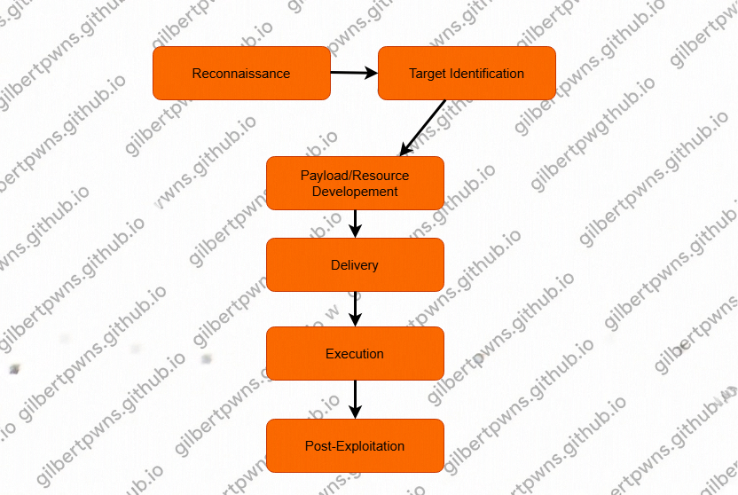

# Client Side Attacks

## Topics

* intro to client side attacks
    + client side information gethering & fingerprinting
* introduction to social engineering
    + social engineering techniques
    + pretexting
* phishing with GoPhish
* resource development & weaponization
* VBA macro development
* generating malicious MS work documents
* HTML application (HTA) attacks
* HTML smuggling
* browser-based attacks

### Prereq

* knowledge of the penetration testing lifecycle
* basic familiarity of Windows & Linux
* basic familiarity with Metasploit Framework

### learning objectives

* [x] You will have an understanding of what ClientSide attacks are and
the various types of client-side attacks utilized for initial access.
* [x] You will be able to perform client-side information and fingerprinting
in order to identify key info regarding a target’s client-side
configuration (browser, OS etc).
* [x] You will have a solid understanding of what Social Engineering is, the
types of Social Engineering attacks used and the role of pretexting in
successful social engineering campaigns.
* [x] You will be able to plan, deploy and manage phishing
exercises/campaigns with tools like GoPhish.
* [x] You will have an understanding of what resource development and
weaponization are in terms of client-side attacks.
* [x] You will be able to develop your own VBA macros for initial access.
* [x] You will have the ability to leverage functionality like ActiveX Controls
to control/facilitate macro execution in documents.
* [x] You will be able to develop and customize your own Macro enabled
MS Office documents for use in obtaining initial access.
* [x] You will be able to leverage HTML Applications for initial access.

## Client-Side Attacks

Client-side attacks refer to techniques and tactics used by attackers to exploit vulnerabilities or misconfigurations in client-side software or systems accessed by users/employees of a target organization

The objectives of these attacks involve compromising end-user devices, applications or behaviors in order to gain initial access to target systems

In the context on pentesting and red teaming, client-side attacks aim to simulate/emulate real-work threats and assess an organization's security posture by targeting the weakest link in the security chain: **employees** 

## Steps for Client-Side Attacks & Methodology

Step 1: Reconnaisance
Step 2: Target Identification
Step 3: Payload/Resource Development
Step 4: Payload Preparation
Step 5: Payload Delivery
Step 6: Payload Execution
Step 7: Post-Exploitation

## Client Side Attack Vectors

What are attack vectors?

In the context of pentesting, an attack vector refers to a path or method used by an attacker to exploit vulnerabilities or weaknesses in a system, network, or application

Attack vectors are the specific avenues through which an attacker gains unauthorized access, achieves malicious objectives, or compromises the security of a target environment.

Here are some of the most common and effective client-side attack vectors used for initial access by attackers or penetration testers:

### Social Engineering

* **Phishing Emails**: deceptive emails with malicious attachments or links to trick users into clicking or downloading malware
* **Social Media Engineering**: Creating fake profiles to connect with users and deceive them into clicking on malicious links or downloading infected content
* **Pretexting, Baiting, Tailgating**: various tactics used to manipulate users into divulging sensitive information or performing actions that facilitate the attack

### Malicious Documents/Payloads

Crafted documents (e.g.: Microsoft Office files, PDFs) with embedded macros, scripts, or exploits that execute malicious code upon opening.

### Drive-by Downloads

Hosting malicious content or exploit kits on compromised or malicious websites to automatically download and execute malware when users visit the site.

### Watering Hole Attacka

Compromising websites frequented by the target audience and injecting malicious code or links to infect visitor's systems.

### USB-based Attacks

### Exploit Kits

### Browser Exploitation

---

🔙 [Homepage](https://gilbertpwns.github.io)