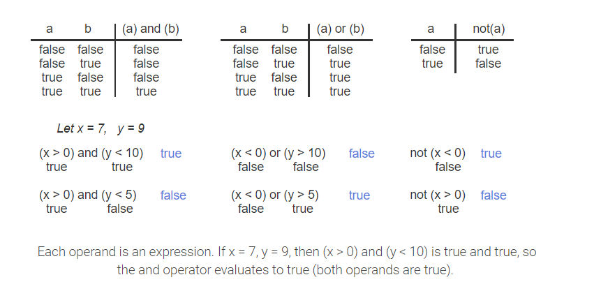

# Branches

## 3.5.1: Logical Operators: and, or, not



## Table 3.5.1: Logical Operators

| Logical Operator | Description |
|:-:|:-:|
|(a) and (b) | **Logical and**: true when both operands are true |
|(a) or (b) | **Logical or**: true when at least one of two operands is true |
| not(a) | **Logical not**: true when the one operand is fals, and vice-versa |


| Operator/Convention | Description | Explanation |
|:-:|:-:|:-:|
| ( )	| Items within parentheses are evaluated first	| In (a * (b + c)) - d, the + is evaluated first, then *, then -.|
|not	| Logical not is next	| not(x == 1) or y is evaluated as (not(x == 1)) or y|
|* / % + -| Arithmetic operators (using their precedence rules; see earlier section) | 	z - 45 * y < 53 evaluates * first, then -, then <.|
|< |  <=   >   >=	| Relational operators |	x < 2 or x >= 10 is evaluated as (x < 2) or (x >= 10) because < and >= have precedence over the or operator. |
|==  !=	| Equality and inequality operators	| x == 0 and x >= 10 is evaluated as (x == 0) and (x >= 10) because == and >= have precedence over the and operator.| 
|and	| Logical and |	x == 5 or y == 10 and z != 10 is evaluated as (x == 5) or ((y == 10) and (z != 10)) because the and operator has precedence over the or operator.| 
|or |	Logical OR |	or has the lowest precedence of the listed arithmetic, logical, and relational operators. |


## 3.8


```
numMeters = 0.7; 
numMeters = numMeters - 0.4;
numMeters = numMeters - 0.3;
     
// numMeters expected to be 0,
// but is actually -0.0000000000000000555112
```

* Floating-point numbers can't always be exactly represented in limited memory bits. 0.7 is actually 0.6999... 0.4 is 0.400...00222... 0.3 is 0.2999... Thus, 0.7 - 0.4 - 0.3 should be 0 but is actually -0.00...0055...
* Thus, floats should not be compared with ==. If numMeters = 0.7, and then 0.4 is subtracted, then 0.3 is subtracted, then numMeters == 0.0 should yield true but will actually yield false.
* Instead, floats should be compared for "close enough": If the difference is less than say 0.0001, the values are considered equal. Absolute value is applied since the difference could be negative.


---

↩️ [BACK](../edu.md)