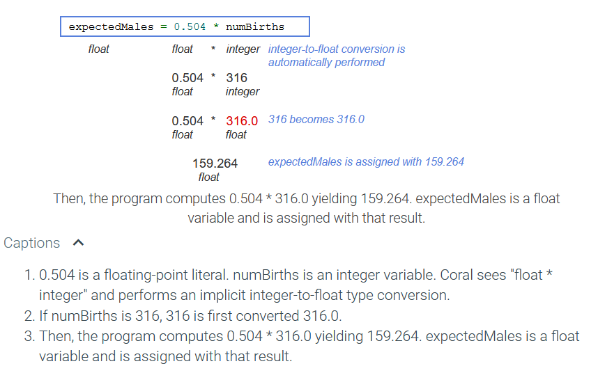

# variables-and-assignments

## 2.7 floating-point numbers (float)

* A **floating-point number** is a real number, like 98.6, 0.0001, or -666.667. The term "floating-point" refers to the decimal point being able to appear anywhere ("float") in the number. A variable declared as type float stores a floating-point number.

* A **floating-point literal** is a number with a fractional part, even if that fraction is 0, as in 1.0, 0.0, or 99.573. Good practice is to always have a digit before the decimal point, as in 0.5, since .5 might mistakenly be viewed as 5.

---

*Scientific notation*

A system may print large or small floating-point values using scientific notation. Ex: If a float variable holds the value 299792458.0 (the speed of light in m/s), the value may be printed as 2.99792e+08. The printed value may have some rounding for conciseness, and the power of 10 makes the number's magnitude more apparent. The value held in the variable is unchanged.

### Choosing a variable type

A programmer should choose a variable's type based on the type of value held.

* Integer variables are typically used for values that are counted, like 42 cars, 10 pizzas, or -95 days.
* Floating-point variables are typically used for values that are measured, like 98.6 degrees, 0.00001 meters, or -666.667 grams.
* Floating-point variables are also used when dealing with fractions of countable items, such as the average number of cars per household.

Note: Some programmers warn against using floating-point for money, as in 14.53 representing 14 dollars and 53 cents, because money is a countable item (reasons are discussed further in another section). Integers may be used to represent cents or to represent dollars when cents are not included, such as for an annual salary (e.g., 40000 dollars, which are countable).

### Floating-point divide by zero

Dividing a nonzero floating-point number by zero is undefined in regular arithmetic. Many programming languages produce an error when performing floating-point division by 0, but Coral does not. Coral handles this operation by producing **infinity** or **-infinity**, depending on the signs of the operands. Printing a floating-point variable that holds infinity or -infinity outputs Infinity or -Infinity.

If the dividend and divisor in floating-point division are both 0, the division results in a "not a number". Not a number indicates an unrepresentable or undefined value. Printing a floating-point variable that is not a number outputs NotANumber.

### manipulating floating-point output

Some floating-point numbers have many digits after the decimal point. Ex: Irrational numbers (Ex: 3.14159265359...) and repeating decimals (Ex: 4.33333333...) have an infinite number of digits after the decimal. By default, most programming languages output at least 5 digits after the decimal point. But for many simple programs, this level of detail is not necessary. A common approach is to output floating-point numbers with a specific number of digits after the decimal to reduce complexity or produce a certain numerical type (Ex: Representing currency with two digits after the decimal). The syntax for outputting the float myfloat with three digits after the decimal point is

> Put myfloat to output with 3 decimal places

When outputting a certain number of digits after the decimal, Coral rounds the last output digit, but the floating-point value remains the same.

## 2.8 using math functions

### basics

Some programs require math operations beyond +, -, *, /, like computing a square root. Coral has a few built-in math operations, known as functions.

A **function** is a list of statements executed by invoking the function's name, with such invoking known as a **function call**. Any function input values, or **arguments**, appear within ( ), and are separated by commas if more than one. Below, the function SquareRoot is called with one argument, areaSquare. The function call evaluates to a value, as in SquareRoot(areaSquare) below evaluating to 7.0, which is assigned to sideSquare.

### coral's built in math functions

| function | behavior | example
|:-:|:-:|:-:|
| SquareRoot(x)	| Square root of x | SquareRoot(9.0) evaluates to 3.0. |
| RaiseToPower(x, y) | Raise x to power y:x^y | RaiseToPower(6.0, 2.0) evaluates to 36.0. |
| AbsoluteValue(x) | Absolute value of x | AbsoluteValue(-99.5) evaluates to 99.5. | 

### Calls in arguments

Commonly a function call's argument itself includes a function call. Below, x^2,  is computed via RaiseToPower(x, y). The result is used in an expression that is an argument to another call, in this case to RaiseToPower() again: RaiseToPower(2.0, RaiseToPower(x, y) + 1).

## 2.9 Random Numbers

### generating a random number

Some programs need to use a random number. Ex: A game program may need to roll dice, or a website program may generate a random initial password.

The **RandomNumber()** function is a built-in Coral function that takes two arguments, lowValue and highValue, and returns a random integer in the range lowValue to highValue. Ex: RandomNumber(1, 10) returns a random integer in the range 1 to 10.

### pseudo-random

Integers generated by RandomNumbers() are known as pseudo-random. 


## 2.10 Integer rounding

### Division: Integer rounding

When the operands of / are both integers, the operator performs integer division, which does not generate any fraction.

If at least one operand of / is a floating-point type, then floating-point division occurs. So if integer w = 10 and float x = 4.0, then w / x is 2.5.

### 2.10.2

Example questions (gotchas):

2.) 

> 4 / 9 

Answer: 9 does not divide into 4, so the answer is 0. No fraction is generated. 

3.)

> (5 + 10 + 15) * (1 / 3)

Answer: 1 / 3 performs integer division, evaluating to **0**. Thus the entire expression evaluates to 0. A better expression would be (5 + 10 + 15) / 3. 

### Divison" Divide by 0

For integer division, the second operand of / or % must never be 0, because division by 0 is mathematically undefined. A divide-by-zero error occurs at runtime if a divisor is 0, causing a program to terminate.

## 2.10.4: Integer division and dividing by Zero

2.)

> 100 * (1 / 2)

The expression in the parentheses is evaluated first, yielding 0 due to integer division. Then 100 * 0 is 0. 

4.)

> 100 / (1 / 2)

Answer: Error

The expression in the parentheses is evaluated first, yielding 0 due to integer division. Then 100 / 0 is undefined and causes the program to terminate. 

5.

```
x = 2;
y = 5;
z = 1 / (y - x - 3);
```

Answer: Error

The expression in the parentheses is evaluated first: 5 - 2 - 3 is 0. Then 1 / 0 is undefined and causes the program to terminate. 

## 2.10.1: Integer Divison

## 2.11 Type conversion

Type conversions

A **type conversion** is a conversion of one data type to another, such as an integer to a float. Coral automatically performs several common conversions between integer and float types, and such automatic conversion is known as **implicit conversion**. 

* For an arithmetic operator like + or *, if either operand is a float, the other is automatically converted to float, and then a floating-point operation is performed.
* For assignments, the right side type is converted to the left side type.

---

* *integer-to-float* conversion is straightforward: 25 becomes 25.0
* *float-to-integer* just drops the fraction: 4.9 becomes 4

## 2.11.1: Implicit type conversion: integer-to-float




---

↩️ [BACK](./scripting-and-programming-foundations.md)
