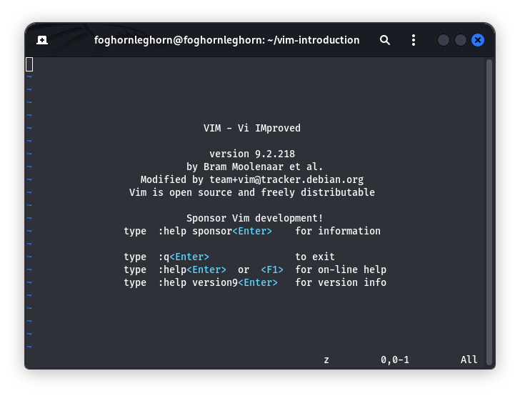

# vim

## Cisco U. Tutorial

* Overview
* Why use Vim At All?
* Using the docker container
* Writing your first text
* Navigating your text
* Navigating your text file part 2
* Searching with 'file'
* Enhancing Vim and it's settings
* Congratulations

---

## Writing your First Text with 'Vim'

You can use most standard terminals and many operation systems have a vim package preinstalled. Start this tutorial by making a new directory and switching over.

```
mkdir ~/vim-introduction
cd ~/vim-introduction
```

You can simply type *vim* to open the text editors main menu.




---
